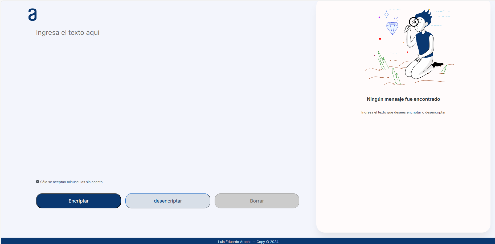

# 🔏 Encriptador de texto

 

     

---

## 💡 Descripción

Encriptador de Texto desarrollado con **JavaScript, HTML y CSS** como parte del desafío del **_Proyecto ONE de Oracle + Alura LATAM_**.

    
    
    

Este desafío consiste en crear una página web capaz de encriptar y desencriptar texto ingresado por el usuario, mostrando el contenido en su forma encriptada o desencriptada. El objetivo principal es evaluar los conocimientos adquiridos durante el curso "Principiante en Programación".

El encriptador detecta automáticamente si el usuario ingresa mayúsculas o palabras con acentos. En caso de detectar estas inconsistencias, se ejecuta una animación para advertir al usuario sobre el error.

- Los botnes de copiado y pegado el texto encriptado/desencriptado para la sección de desifrar, cumplen la mismas fuciones de Ctrl + C y Ctrl + V.
---

## 🔑 Llaves de encriptacion

Las llaves de encriptacion solicitadas son las siguientes:

- La letra "**a**" es convertida a "**ai**".
- La letra "**e**" es convertida a "**enter**".
- La letra "**i**" es convertida a "**imes**".
- La letra "**o**" es convertida a "**ober**"
- La letra "**u**" es convertida a "**ufat**"

---

## ✔️ Requisitos

Requisitos

El encriptador debe funcionar únicamente con letras minúsculas.

No se deben utilizar letras con acentos ni caracteres especiales.

Debe ser posible convertir una palabra a su versión encriptada y, de manera inversa, retornar la palabra encriptada a su versión original.

Ejemplo:

"perro" => "penterrober"
"penterrober" => "perro"

La página debe incluir campos de entrada para que el usuario ingrese el texto a encriptar o desencriptar, y debe permitirle elegir entre ambas opciones.

El resultado de la encriptación o desencriptación debe mostrarse en pantalla.

---

### Autor:
- Luis Eduardo Aroccha Coronado  
